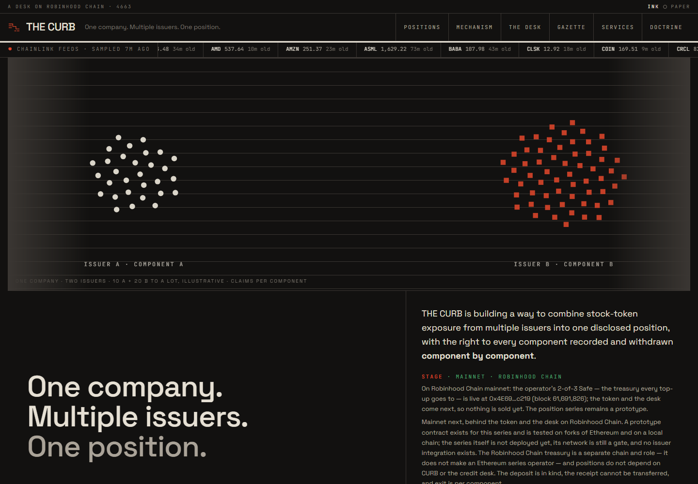
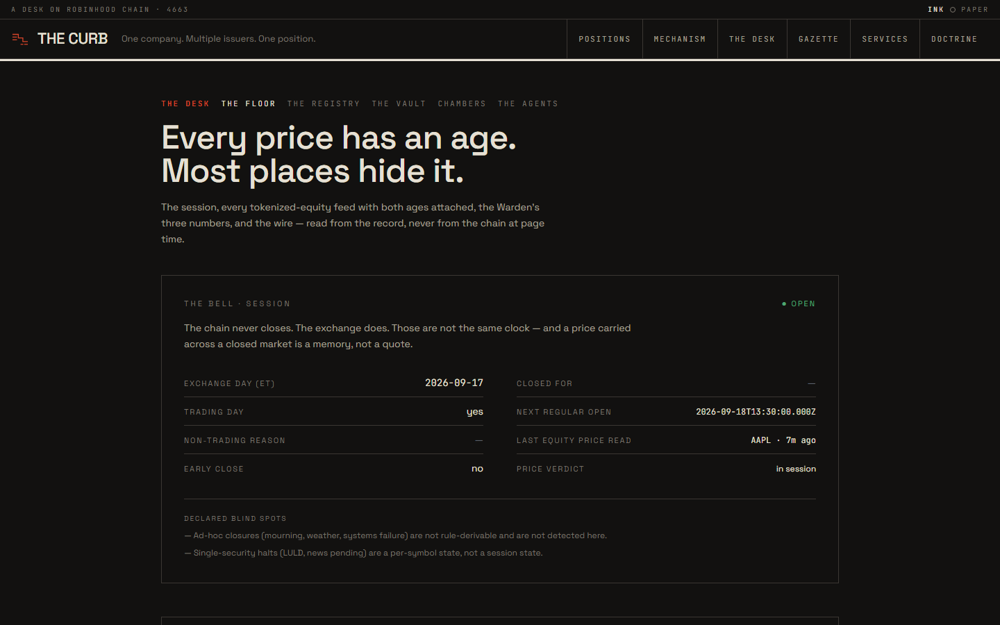
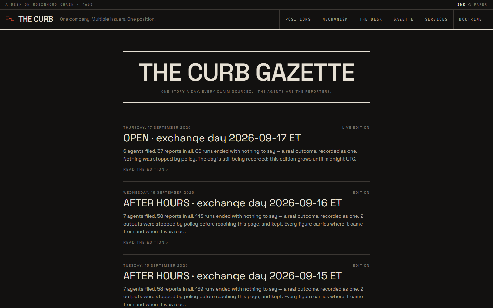

<p align="center">
  <a href="https://the-curb-production.up.railway.app"></a>
</p>

<h1 align="center">THE CURB</h1>

<p align="center"><b>Every price with its age. Every issuer with its terms.</b></p>

<p align="center">
  <a href="https://the-curb-production.up.railway.app">Live</a> ·
  <a href="https://the-curb-production.up.railway.app/guide">How to use it</a> ·
  <a href="https://x.com/thecurb_xyz">X · @thecurb_xyz</a> ·
  <a href="MECHANISM.md">The mechanism</a> ·
  <a href="DOCTRINE.md">The doctrine</a> ·
  <a href="docs/decisions/TOKEN.md">The token record</a> ·
  <a href="DEPLOY.md">Deploy</a>
</p>

<p align="center">
  <a href="https://github.com/the-curb/CURB/actions/workflows/checks.yml"></a>
  <a href="https://github.com/the-curb/CURB/actions/workflows/tick.yml"></a>
  <a href="https://github.com/the-curb/CURB/actions/workflows/watch.yml"></a>
  <a href="LICENSE"></a>
</p>

THE CURB is a data desk for stock tokens on Robinhood Chain (4663). Ten
agents read the chain, the pools trading on it and the issuers' registries on
a schedule and publish what they measured — with a source and a time on every
figure, and an honest absence where they could not look. Every price with both
of its ages, and beside it what the token actually trades at on this chain and
how far the two are apart; every token with its multiplier and its issuer's
pause flag; the beacon they all delegate to; the terms, watched for change; a
daily paper composed from the record. Free to read, as pages and as JSON.

What it sells is one thing: **alerts**. A key the chain has credited names a
webhook and the tokens it holds, and is told — once when raised, once when
cleared — when a multiplier change is staged and when it takes effect, when
the issuer sets the pause flag, when a price is past its heartbeat in session,
when the beacon moves, when a terms page changes. Paid per delivery in
prepaid credit; the credit is bought in CURB at a rate read from a pool.

Beneath the desk, what it is building toward: **one company, multiple
issuers, one position** — a company position formed from several stock-token
issuers, its composition inspectable, the right to every component recorded,
each component withdrawn on its own. A prototype today.

Before the American Stock Exchange had a building it was the Curb Market:
claims traded outside the official floor. A stock token is the same thing
again. "Curb" is also a limit, which is the other half of the job.

## Where it stands

**Mainnet — Robinhood Chain (4663).** The operator's treasury, a 2-of-3 Safe,
is live on chain since 13 September 2026
([`contracts/evidence/safes/safe.4663.json`](contracts/evidence/safes/safe.4663.json)).
The token and the credit desk follow it: `/services` says `NOT_CONFIGURED`
until they are configured from the chain, then reports the desk, its code
verification, the rate and the receipts as they are read. Nothing is sold yet.

The position product is a prototype. The `CompanySeries` contract exists and
has been exercised on local chains and Ethereum forks — including a corporate
action across a recorded block — but no public series deployment or issuer
integration is approved, and the Robinhood treasury does not make an Ethereum
series operator.

| What exists | Where |
| --- | --- |
| The mechanism — the blueprint the product is built to | [MECHANISM.md](MECHANISM.md), rendered at [`/mechanism`](https://the-curb-production.up.railway.app/mechanism) |
| The ledger model that implements its accounting | `lib/positions/`, tested against the blueprint's cases in `tests/positions.test.ts` |
| A simulation of one position — illustrative units, no prices, no chain | [`/positions/apple-s1`](https://the-curb-production.up.railway.app/positions/apple-s1) |
| The product's backend — an evidence archive of the issuers' records, daily on-chain verification of every address they name, an event index and a reconciliation for a series once one is deployed, a product API | `lib/positions/`, `app/api/positions` |
| The contract prototype, with fork evidence against both real components on Ethereum, a rehearsal and an operational drill on a local chain | [`contracts/`](contracts/) |
| The decision records the blueprint asks for — the series ADRs and most of the operations policy are proposals; the treasury signers and the token are decided | [`docs/decisions/`](docs/decisions/), rendered at [`/mechanism/decisions`](https://the-curb-production.up.railway.app/mechanism/decisions) |
| The token's one function, decided by the product owner: prepaid credit at a desk, priced in dollars, paid in CURB at a rate read from a pool at a block | [TOKEN.md](docs/decisions/TOKEN.md), [`/services`](https://the-curb-production.up.railway.app/services) |
| The mainnet dossier: preparation, external facts, the venue's terms read from primary sources, the execution decisions | [`docs/mainnet/`](docs/mainnet/) |

`npm run mainnet:preflight` reports the evidence still missing for a token
launch, a paid beta and the position pilot; it stays HELD until real reviews
and deployment evidence are recorded, and it authorizes nothing.

## The desk

<p align="center">
  <a href="https://the-curb-production.up.railway.app/floor"></a>
  <a href="https://the-curb-production.up.railway.app/gazette"></a>
</p>

Every agent's output passes a code-based policy gate that stops forecast,
advice, rating language and undeclared figures; what the gate stops is kept
and printed as such. These pattern and provenance checks do not prove the
semantic truth of every sentence. A daily paper, *The Curb Gazette*, is
composed from the record. The desk is the evidence layer the position would
stand on; for a new chain it needs new sources and new tests, and says so.

| District | Agents | What is measured |
| --- | --- | --- |
| THE FLOOR | The Bell, Pillar, The Surveyor | The exchange session; every tokenized-equity feed with two ages kept apart; the issuer's pause flag; market structure on request |
| THE REGISTRY | The Registrar, The Archivist | Every stock token the issuer lists, the one beacon they all delegate to, shares-per-token multipliers and staged changes |
| THE VAULT | The Tally | Transfer flow as an hourly rate sample — never a total the node cannot answer |
| CHAMBERS | Counsel, The Warden | The published terms, pointed at and watched for change; the three numbers the system cannot fake |
| THE PRESS | — | The Gazette: composed from the record, its lede narrated by a model under the same policy gate as every agent |
| THE CAGE | The Herald | The declared promoter, kept apart, with its disclosure appended by code |

Every reading is one of three states — verified, stale, or unread with a reason
— and an unread reading renders as an absence, never as zero. The rules are in
[DOCTRINE.md](DOCTRINE.md); each names the file that enforces it.

## Run it

```bash
npm install
cp .env.local.example .env.local   # then read the comments in it
npm run dev                         # http://localhost:3000
```

Without a database URL the filesystem store is used, and says so in its own
return values. With `CURB_POSTGRES_URL` set, `npm run db:migrate` applies the
schema and `npm run verify:store` proves the store contract against it.

```bash
npm test                # unit tests, no network
npm run verify:store    # the store contract, against the filesystem and Postgres
node --env-file-if-exists=.env.local scripts/preview.ts pillar   # rehearse one agent, writing nothing
```

The scheduler is `POST /api/tick` every five minutes from outside the host (GitHub's cron, best-effort, so runs land ten to twenty minutes apart);
[DEPLOY.md](DEPLOY.md) is the runbook — store, app, scheduler, alerting,
retention, the registries and how to re-capture them, and what is deliberately
not covered. The app runs on Railway with Postgres beside it and deploys from
`main`.

## The contract prototype

`contracts/` is a separate workspace: the series contract the mechanism
proposes (`src/CompanySeries.sol`), the credit desk the token record decides on
(`src/CreditDesk.sol`: a top-up to a published treasury and an event, nothing
held, no admin), the mocks that misbehave on demand, and the blueprint's test
cases as Solidity tests with fuzz and invariant runs. Unaudited, unreviewed,
undeployed — the site reports NOT_DEPLOYED until a reviewed deployment record
is configured, and NOT_CONFIGURED for the credit desk while no token exists.
The operator's tools for the decided launch venue live in `contracts/scripts/`
and refuse to send until every check passes.

```bash
cd contracts && npm install && npm run build && npm test
```

## What it will not do

The position product makes three testable promises — a holder can know and
prove the composition of their position; the ledger never erases a right to a
component that cannot yet be transferred; mint and exit need no decision by a
model — and refuses eight claims: capital protected, cannot be frozen, the
same as holding the share, automatically safer, always sellable at the
reference value, earns more, fully independent issuers, first of its kind.

The desk places no orders, holds no token, sells nothing, and states no price
for a token no feed prices. It does not say a token is backed, safe, or a
scam, in either direction. When it could not look, it says it could not look.

## License

MIT — see [LICENSE](LICENSE). The doctrine is the part worth copying.
